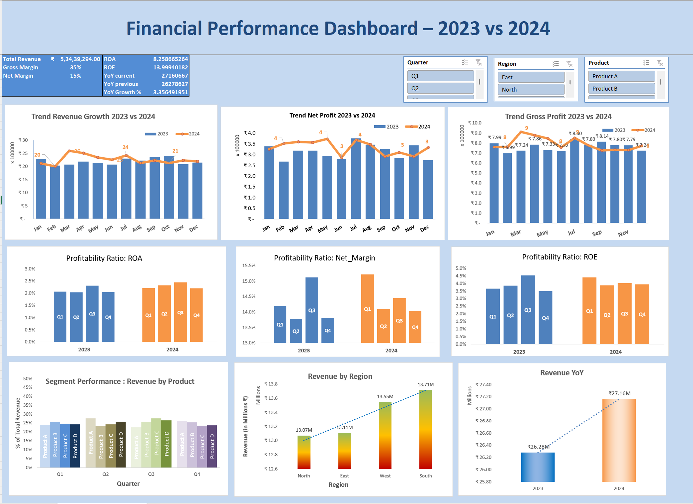
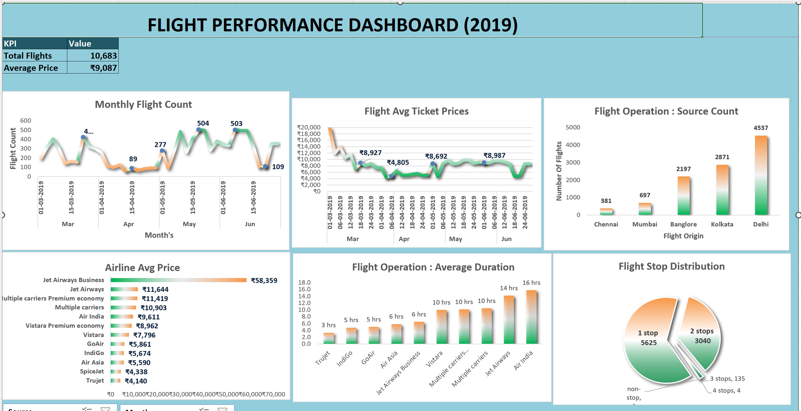
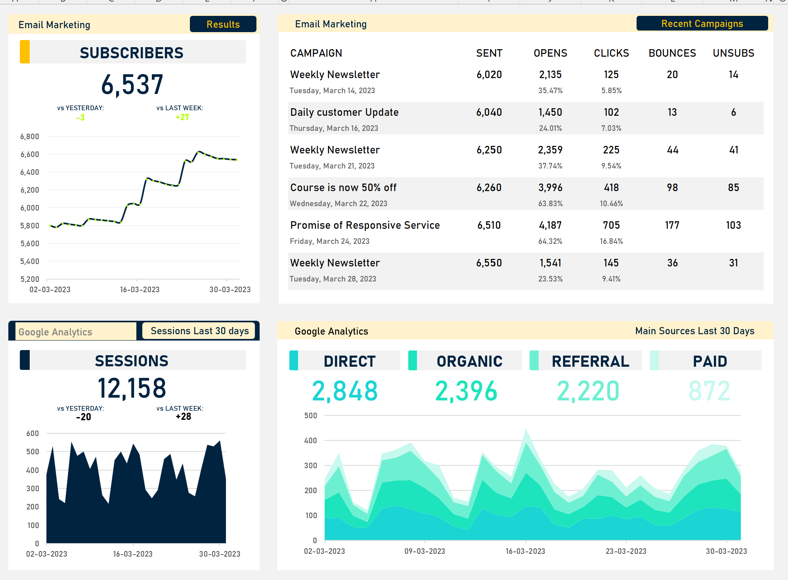
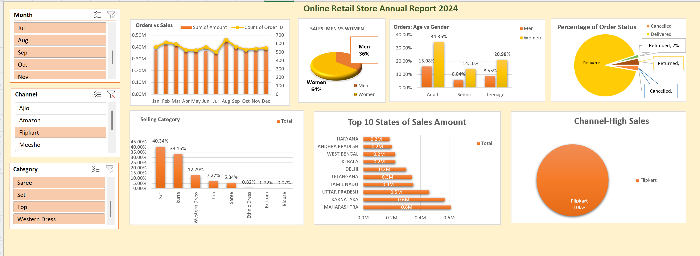
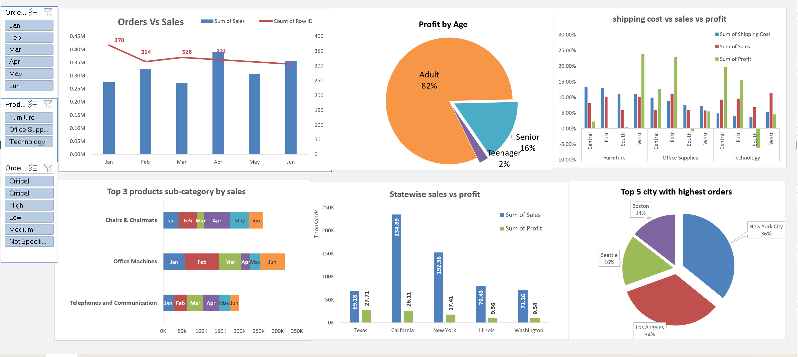

# excel-dashboards
# 📊 Dashboards Portfolio

This repository showcases my Excel dashboard projects built for data analysis and visualization across **Finance, Flights, Marketing, Retail, and Superstore** datasets.

Each dashboard uses:
- Pivot Tables & Charts
- Slicers and Filters
- Conditional Formatting
- KPI Indicators & Ratio Analysis
- Business-style Dashboard Layouts

---

## 💹 Financial Performance Dashboard (2023 vs 2024)

**Highlights:**
- Trend analysis of Revenue, Profit, and Margin (YoY)
- Profitability ratios: ROA, ROE, Net Margin
- Revenue by Product & Region
- Quarterly filters for dynamic analysis  
📂 [Download Excel File](dashboards/Financial_Dashboard_Dataset.xlsx?raw=1)

---

## ✈️ Flight Performance Dashboard (2019)

**Highlights:**
- Monthly flight count & average ticket price
- Airline average price and duration
- Stop distribution and source count  
📂 [Download Excel File](dashboards/Flight_Dashboard_Combined.xlsx?raw=1)

---

## 📈 Marketing Campaign Dashboard

**Highlights:**
- CTR, CPC, ROAS performance
- Ad spend and conversion tracking
- Channel-wise performance comparison  
📂 [Download Excel File](dashboards/Marketing-Dashboard-Template-Template.xlsx?raw=1)

---

## 🛒 Online Retail Store Data Analysis

**Highlights:**
- Product category & region analysis
- Top-performing SKUs
- Revenue growth trend  
📂 [Download Excel File](dashboards/Online%20Retail%20Store%20Data%20Analysis.xlsx?raw=1)

---

## 🏬 SuperStore US 2015 Dashboard

**Highlights:**
- Profitability by Segment & Ship Mode
- Sales by Region and Category
- Return rate tracking  
📂 [Download Excel File](dashboards/SuperStoreUS-2015.xlsx?raw=1)

---

### 🧠 Tools & Skills Used
- Microsoft Excel (Pivot Tables, Slicers, Charts)
- Data Cleaning & Aggregation
- Financial and Operational KPI Tracking
- Dashboard Design Principles

---

### 📎 About Me
**Sandeep Kumar Mishra**  
Aspiring Data Analyst | Excel • SQL • Python • Tableau  
📍 Bangalore, India  
🌐 [LinkedIn Profile](https://linkedin.com/in/sandeep-1531)

---
⭐ **Star this repo** if you like these dashboards!
